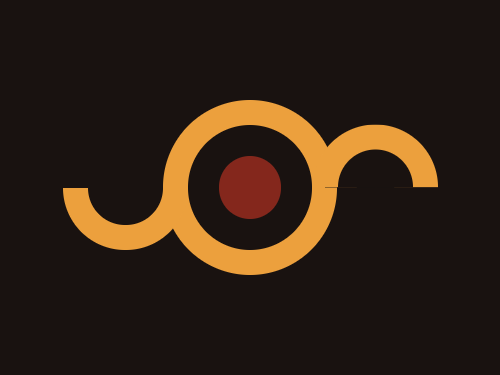
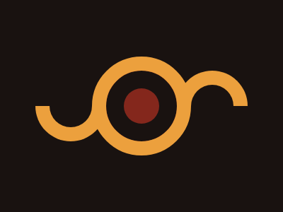

# #11. Eye of Sauron

Challenge: <https://cssbattle.dev/play/11>

## Result

<table>
	<tr>
		<th width="50%">User Submission</th>
		<th width="50%">Target</th>
	</tr>
	<tr>
		<td width="50%" align="center">
			
		</td>
		<td width="50%" align="center">
			
		</td>
	</tr>
</table>

## Code

```html
<p x><p a><p a b><style>*{background:#191210}p{position:fixed;height:50;width:50;border-radius:1in;border:25px solid#191210;margin:92 142}[x]{background:#84271C;outline:5vw solid#ECA03D}[a]{height:30;width:60;border:5vw solid#ECA03D;border-radius:0 0 110px 110px;border-top:0;margin:142 42}[b]{scale:1-1;margin:92 242
```
