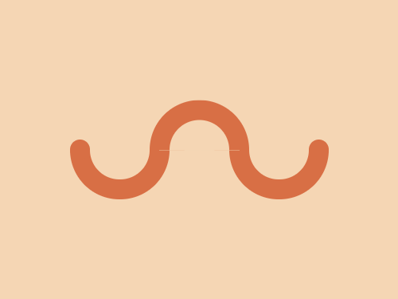

# #12. Wiggly Moustache

Challenge: <https://cssbattle.dev/play/12>

## Result

<table>
	<tr>
		<th width="50%">User Submission</th>
		<th width="50%">Target</th>
	</tr>
	<tr>
		<td width="50%" align="center">
			
		</td>
		<td width="50%" align="center">
			
		</td>
	</tr>
</table>

## Code

```html
<p d><p d a><p d b><p c><p c e><style>*{background:#f5d6b4}p{height:30;width:60;border-radius:0 0 1in 1in;margin:30-100;margin:142 62;position:fixed}[a]{left:168}[b]{scale:1-1;margin:93 142}[d]{border:5vw solid#D86F45;border-top:0}[c]{background:#D86F45;height:20;width:20;border-radius:1in;top:-2}[e]{left:248
```
