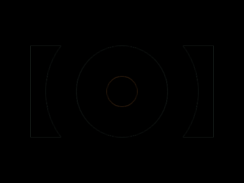

# #3. Push Button

Challenge: <https://cssbattle.dev/play/3>

## Result

<table>
	<tr>
		<th width="50%">User Submission</th>
		<th width="50%">Target</th>
	</tr>
	<tr>
		<td width="50%" align="center">
			
		</td>
		<td width="50%" align="center">
			
		</td>
	</tr>
</table>

## Code

```html
<div class="r"></div><div class="c a"></div><div class="c b"></div><div class="c d"></div><style>body{background:#6592CF;display:flex;align-items:center;justify-content:center}.r{width:300;height:150;background:#243D83}.c{border-radius:50%;position:absolute}.a{width:250;height:250;background:#6592CF}.b{width:150px;height:150px;background:#243D83}.d{width:50px;height:50px;background:#EEB850
```
