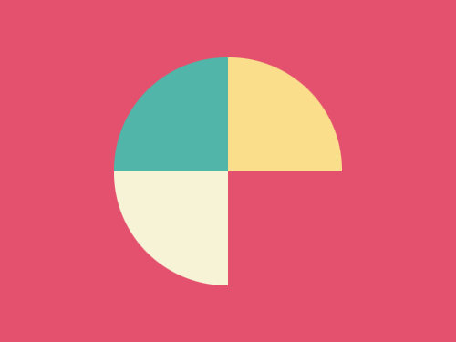

# #6. Missing Slice

Challenge: <https://cssbattle.dev/play/6>

## Result

<table>
	<tr>
		<th width="50%">User Submission</th>
		<th width="50%">Target</th>
	</tr>
	<tr>
		<td width="50%" align="center">
			
		</td>
		<td width="50%" align="center">
			
		</td>
	</tr>
</table>

## Code

```html
<div class="s"></div>
<div class="s a"></div>
<div class="s b"></div>
<style>
  body {
    background: #e3516e;
  }
  .s {
    position: absolute;
    width: 100px;
    height: 100px;
    background: #f7f3d7;
    top: 150px;
    left: 100px;
    border-bottom-left-radius: 100%;
  }
  .a {
    transform: rotate(90deg);
    top: 50px;
    background: #51b5a9;
  }
  .b {
    transform: rotate(180deg);
    top: 50px;
    left: 200px;
    background: #fade8b;
  }
</style>
```
