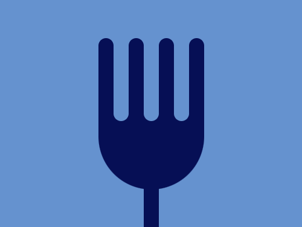

# #8. Forking Crazy

Challenge: <https://cssbattle.dev/play/8>

## Result

<table>
	<tr>
		<th width="50%">User Submission</th>
		<th width="50%">Target</th>
	</tr>
	<tr>
		<td width="50%" align="center">
			
		</td>
		<td width="50%" align="center">
			
		</td>
	</tr>
</table>

## Code

```html
<p><style>body{background:#6592CF;margin:210 190}p{width:20;height:110;background:#060F55;border-radius:10px;box-shadow:-60px -40vw#060F55,-5ch -40vw#6592CF,-5vw -40vw#060F55,0px -40vw#6592CF,5vw -40vw#060F55,5ch -40vw#6592CF,60px -40vw#060F55}p:before{content:"";position:absolute;background:#060F55;width:35vw;height:25vw;left:130;top:150;border-radius:0 0 70px 70px;z-index:-1
```
