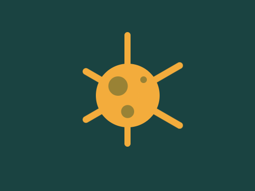
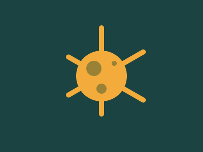

# #47. Corona Virus

Challenge: <https://cssbattle.dev/play/47>

## Result

<table>
	<tr>
		<th width="50%">User Submission</th>
		<th width="50%">Target</th>
	</tr>
	<tr>
		<td width="50%" align="center">
			
		</td>
		<td width="50%" align="center">
			
		</td>
	</tr>
</table>

## Code

```html
<body bgcolor=1A4341><p><p a><p b><p c><p c d><style>p{position:fixed;height:180;width:10;background:#F3AC3C;border-radius:50px;margin:42 187}[a]{transform:rotate(60deg);top:13;left:16}[b]{transform:rotate(-60deg);top:23;left:16}[c]{height:10;width:10;border-radius:75vw;background:#998235;top:78;left:33;box-shadow:-40px 10px 0 10px#998235,-25px 50px 0 5px#998235}[d]{background:#F3AC3C;height:100;width:100;box-shadow:none;top:58;left:-37;z-index:-1
```
