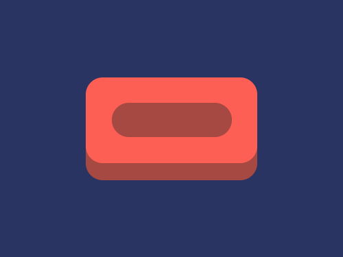
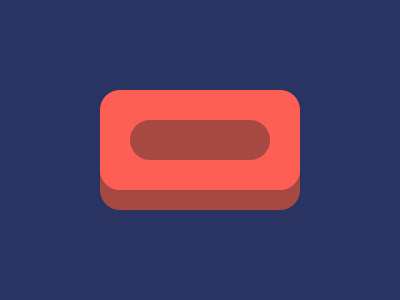

# #48. Wash Your Hands

Challenge: <https://cssbattle.dev/play/48>

## Result

<table>
	<tr>
		<th width="50%">User Submission</th>
		<th width="50%">Target</th>
	</tr>
	<tr>
		<td width="50%" align="center">
			
		</td>
		<td width="50%" align="center">
			
		</td>
	</tr>
</table>

## Code

```html
<p><p a><p b><style>&{background:#293462}p{width:200;height:100;position:fixed;background:#A64942;margin:102 92;border-radius:21q}[a]{background:#FE5F55;top:-12}[b]{height:40;width:140;margin:112 122
```
