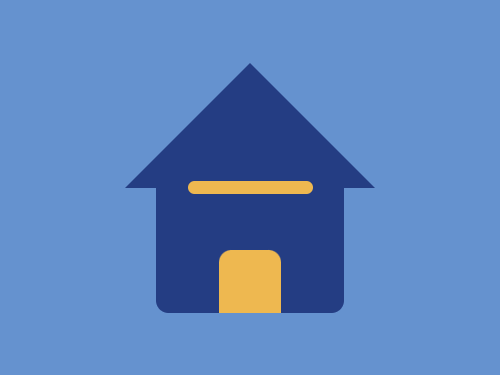
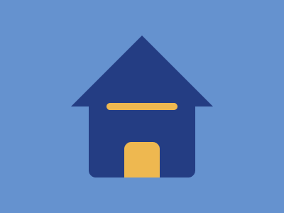

# #49. Stay at Home

Challenge: <https://cssbattle.dev/play/49>

## Result

<table>
	<tr>
		<th width="50%">User Submission</th>
		<th width="50%">Target</th>
	</tr>
	<tr>
		<td width="50%" align="center">
			
		</td>
		<td width="50%" align="center">
			
		</td>
	</tr>
</table>

## Code

```html
<body bgcolor=6592CF><p><p a><p b><p b c><style>p{position:fixed;height:120;width:150;background:#243D83;border-radius:10px;margin:122 117}[a]{width: 0;border-style:solid;border-width:0 25vw 25vw 25vw;border-radius:0;background:#6592CF;border-color:red #6592CF #243D83;top:-192;left:-17}[b]{background:#EEB850;height:10;width:100;top:23;left:33}[c]{height:50;width:50;top:78;left:58;border-radius:10px 10px 0 0
```
