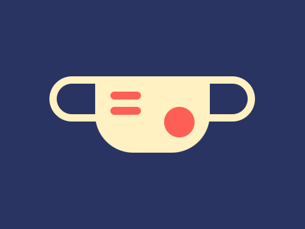
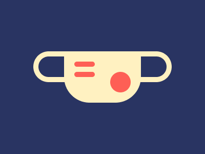

# #51. Wear a Mask

Challenge: <https://cssbattle.dev/play/51>

## Result

<table>
	<tr>
		<th width="50%">User Submission</th>
		<th width="50%">Target</th>
	</tr>
	<tr>
		<td width="50%" align="center">
			
		</td>
		<td width="50%" align="center">
			
		</td>
	</tr>
</table>

## Code

```html
<p d><p c><p><p a><p b><style>*{background:#293462}p{background:#FE5F55;height:10;position:fixed;width:40;margin:112 137;border-radius:1in}[a]{top:28}[b]{height:40;margin:132 207}[c]{background:#FFF1C1;border-radius:0 0 50px 50px;height:100;width:150;margin:92 117}[d]{height:40;width:250;border:10px solid#FFF1C1;background:#0000;margin:92 57}
```
