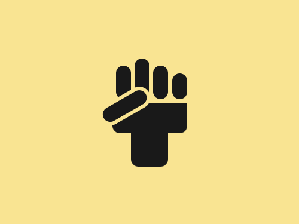
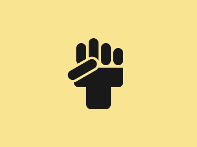

# #54. Black Lives Matter

Challenge: <https://cssbattle.dev/play/54>

## Result

<table>
	<tr>
		<th width="50%">User Submission</th>
		<th width="50%">Target</th>
	</tr>
	<tr>
		<td width="50%" align="center">
			
		</td>
		<td width="50%" align="center">
			
		</td>
	</tr>
</table>

## Code

```html
<p><p a><p b><p c><p d><p d e><p f><style>*{background:#F9E492}p{width:20;height:45;background:#191919;position:fixed;margin:80 147;border-radius:1in}[a]{left:58}[b]{margin:70 172;height:60}[c]{margin:90 222;height:35}[d]{height:40;width:100;border-radius:0 0 10px 10px;margin:130 142}[e]{margin:170 167;height:45;width:50}[f]{border:5px solid#F9E492;rotate:60deg;margin:97 144;height:65
```
