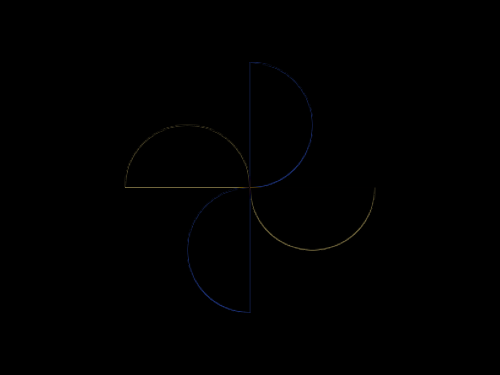

# #55. Windmill

Challenge: <https://cssbattle.dev/play/55>

## Result

<table>
	<tr>
		<th width="50%">User Submission</th>
		<th width="50%">Target</th>
	</tr>
	<tr>
		<td width="50%" align="center">
			
		</td>
		<td width="50%" align="center">
			
		</td>
	</tr>
</table>

## Code

```html
<p><p a><p b><p b c><style>&{background:#191919}p{height:50;width:100;background:#F9E492;margin:92;border-radius:53q 53q 0 0;position:fixed}[a]{rotate:180deg;margin:142 192}[b]{background:#4F77FF;rotate:90deg;margin:67 167}[c]{rotate:-90deg;margin:167 117
```
