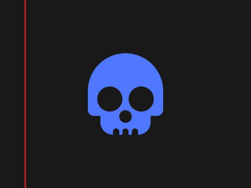
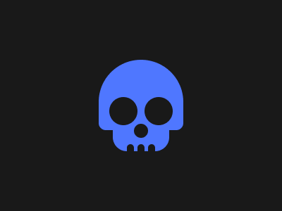

# #56. Skull

Challenge: <https://cssbattle.dev/play/56>

## Result

<table>
	<tr>
		<th width="50%">User Submission</th>
		<th width="50%">Target</th>
	</tr>
	<tr>
		<td width="50%" align="center">
			
		</td>
		<td width="50%" align="center">
			
		</td>
	</tr>
</table>

## Code

```html
<p b><p b a><p c><p c d><p c e><p f><style>*{background:#191919}[b]{background:#4F77FF}p{height:100;width:120;position:fixed;margin:77 132;border-radius:1in 1in 4vw 4vw}[a]{width:80;margin:107 152;border-radius:1in 1in 50px 50px}[c]{border-radius:1in;scale:0.4;width:100;margin:100 117}[d]{left:58}[e]{scale:0.2;margin:128 142}[f]{color:#191919;height:10;width:10;margin:197 172;box-shadow:5vh 0,30px 0
```
