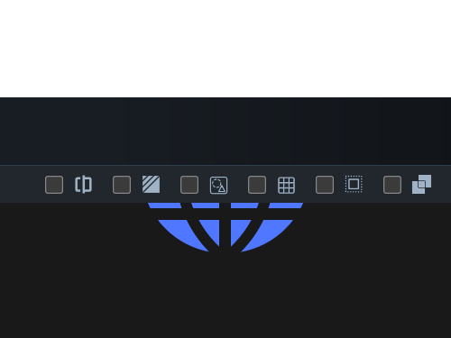

# #59. Earth

Challenge: <https://cssbattle.dev/play/59>

## Result

<table>
	<tr>
		<th width="50%">User Submission</th>
		<th width="50%">Target</th>
	</tr>
	<tr>
		<td width="50%" align="center">
			
		</td>
		<td width="50%" align="center">
			
		</td>
	</tr>
</table>

## Code

```html
<p a><p><p b><p c><p d><p a e><p a e f><style>*{background:#191919}p{position:fixed;width:150;height:10;margin:97 117}[a]{height:150;background:#4F77FF;margin:67 117;border-radius:2in}[b]{top:88}[c]{top:48}[d]{rotate:90deg;top:47}[e]{background:#0000;height:190;width:190;margin:37 147;border:10px solid#191919}[f]{left:-112
```
