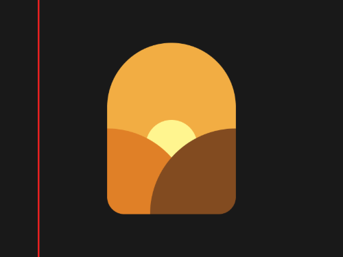
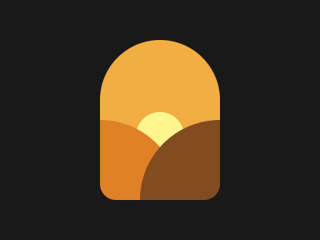

# #62. Sunset

Challenge: <https://cssbattle.dev/play/62>

## Result

<table>
	<tr>
		<th width="50%">User Submission</th>
		<th width="50%">Target</th>
	</tr>
	<tr>
		<td width="50%" align="center">
			
		</td>
		<td width="50%" align="center">
			
		</td>
	</tr>
</table>

## Code

```html
<p><p a><p a b><p c><style>*{background:#F2AD43}p{position:fixed;background:#FFF58F;height:60;width:60;margin:132 162;border-radius:9in}[a]{background:#E08027;scale:3.33;margin:212 87}[b]{background:#824B20;left:158}[c]{border-radius:1in 1in 25px 25px;height:200;width:150;margin:42 117;background:#0000;box-shadow:0 0 0 200px#191919
```
