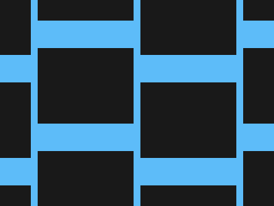

# #67. Video Reel

Challenge: <https://cssbattle.dev/play/67>

## Result

<table>
	<tr>
		<th width="50%">User Submission</th>
		<th width="50%">Target</th>
	</tr>
	<tr>
		<td width="50%" align="center">
			
		</td>
		<td width="50%" align="center">
			
		</td>
	</tr>
</table>

## Code

```html
<body bgcolor=5DBCF9><p><style>p{color:#191919;height:110;width:140;background:currentColor;margin:-38-103;box-shadow:75vw 0,75vw 75vw,75vw 50vh,50vh -53q,50vh 25vw,50vh 250px,0 50vh,0 75vw,450px -53q,450px 25vw,450px 250px
```
