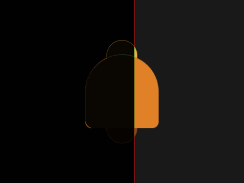

# #68. Bell

Challenge: <https://cssbattle.dev/play/68>

## Result

<table>
	<tr>
		<th width="50%">User Submission</th>
		<th width="50%">Target</th>
	</tr>
	<tr>
		<td width="50%" align="center">
			
		</td>
		<td width="50%" align="center">
			
		</td>
	</tr>
</table>

## Code

```html
<p><p a><p b><style>*{background:#191919;}p{height:50;width:50;background:#F2AD43;margin:58 167;border-radius:1in;position:fixed;}[a]{background:#824B20;top:127}[b]{scale:2.4;top:66;border-radius:1in 1in 20px 20px;background:#E08027
```
