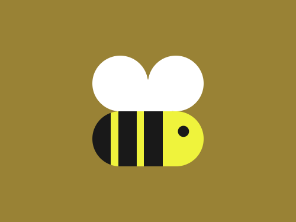

# #76. Beeee

Challenge: <https://cssbattle.dev/play/76>

## Result

<table>
	<tr>
		<th width="50%">User Submission</th>
		<th width="50%">Target</th>
	</tr>
	<tr>
		<td width="50%" align="center">
			
		</td>
		<td width="50%" align="center">
			
		</td>
	</tr>
</table>

## Code

```html
<p><p a><p b><p c><p d><style>*{background:#998235}p{background:#FFF;height:75;width:75;position:fixed;margin:67 117;border-radius:1in}[a]{left:83}[b]{margin:99 150}[c]{width:150;top:83;background:repeating-linear-gradient(90deg,#191919 0 25px,#EFF33C 25px 35px)no-repeat,#EFF33C;background-size:65%1in,1in 1in}[d]{background:#191919;scale:0.2;margin:132 202
```
