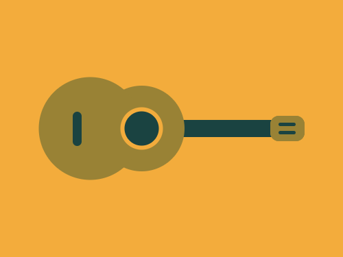
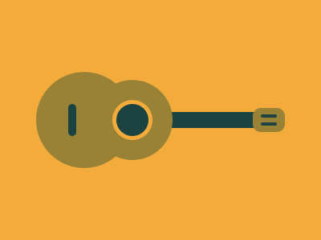

# #78. Ukulele

Challenge: <https://cssbattle.dev/play/78>

## Result

<table>
	<tr>
		<th width="50%">User Submission</th>
		<th width="50%">Target</th>
	</tr>
	<tr>
		<td width="50%" align="center">
			
		</td>
		<td width="50%" align="center">
			
		</td>
	</tr>
</table>

## Code

```html
<p g><p a><p a><p b><p b c><p g b d><p g b d e><p g b d e f><p g b h><style>&{background:#F3AC3C}p{background:#998235;position:fixed;height:20;width:120;margin:132 199}[g]{background:#1A4341}[a]{height:30;margin:127 307;width:40;border-radius:10px}[b]{height:100;width:100;margin:92 107;border-radius:3in}[c]{scale:1.2;left:-52}[d]{height:40;margin:122 77;width:10}[e]{margin:135 317;height:4;width:20}[f]{top:18}[h]{scale:0.4;border:3vw solid#F3AC3C;margin:80 95
```
