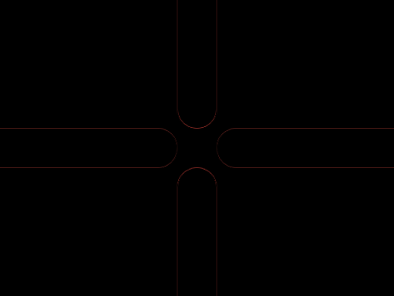
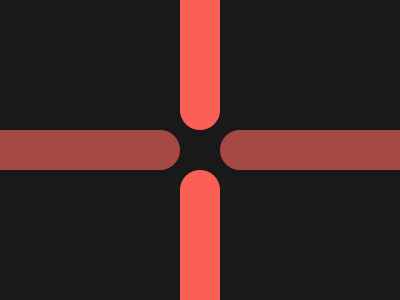

# #84. Junction

Challenge: <https://cssbattle.dev/play/84>

## Result

<table>
	<tr>
		<th width="50%">User Submission</th>
		<th width="50%">Target</th>
	</tr>
	<tr>
		<td width="50%" align="center">
			
		</td>
		<td width="50%" align="center">
			
		</td>
	</tr>
</table>

## Code

```html
<p><p a><p b><p b c><style>&{background:#191919}p{background:#A64942;height:40;position:fixed;width:200;margin:122-28;border-radius:1in}[a]{left:248}[b]{rotate:90deg;background:#FE5F55;margin:2 92}[c]{top:248
```
