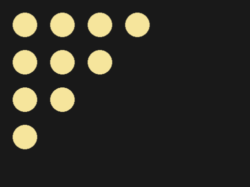
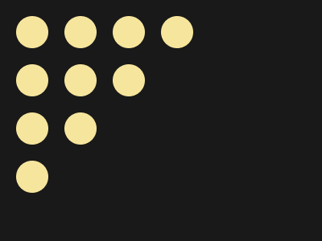

# #109. Curtain

Challenge: <https://cssbattle.dev/play/109>

## Result

<table>
	<tr>
		<th width="50%">User Submission</th>
		<th width="50%">Target</th>
	</tr>
	<tr>
		<td width="50%" align="center">
			
		</td>
		<td width="50%" align="center">
			
		</td>
	</tr>
</table>

## Code

```html
<style>*{background:linear-gradient(-45deg,#191919 59%,#ffffff00 0),radial-gradient(#F6E59C 46%,#191919 0)2q 2q/60px 60px
```
