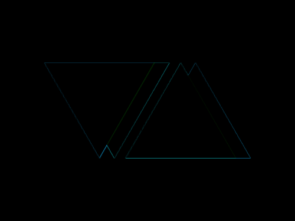

# #14. Web Maker Logo

Challenge: <https://cssbattle.dev/play/14>

## Result

<table>
	<tr>
		<th width="50%">User Submission</th>
		<th width="50%">Target</th>
	</tr>
	<tr>
		<td width="50%" align="center">
			
		</td>
		<td width="50%" align="center">
			
		</td>
	</tr>
</table>

## Code

```html
<body bgcolor=F2F2B6><p o><p y a><p y b><p o b c><style>p{width:0;border-style:solid;border-width:130px 75px 0 75px;margin:77 73;position:fixed}[a]{left:-13}[y]{border-color:#FF6D00#0000}[o]{border-color:#FD4602#0000}[b]{rotate:180deg;left:117}[c]{left:97
```
