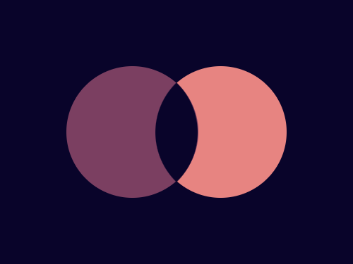

# #15. Overlap

Challenge: <https://cssbattle.dev/play/15>

## Result

<table>
	<tr>
		<th width="50%">User Submission</th>
		<th width="50%">Target</th>
	</tr>
	<tr>
		<td width="50%" align="center">
			
		</td>
		<td width="50%" align="center">
			
		</td>
	</tr>
</table>

## Code

```html
<body bgcolor=#09042A><p><style>p{width:50vh;height:50vh;background:#7B3F61;border-radius:50%;margin:75 67;box-shadow:25vw 0#E78481}p:after{content:'';position:fixed;top:110;left:160;width:80;height:80;border-radius:100%0;transform:rotate(-45deg);background:#09042A
```
