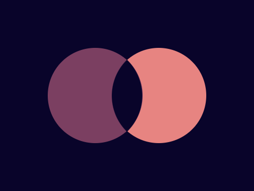
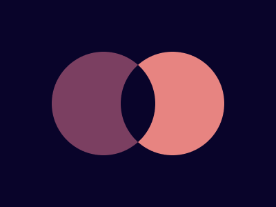

# #15. Overlap

Challenge: <https://cssbattle.dev/play/15>

## Result

<table>
	<tr>
		<th width="50%">User Submission</th>
		<th width="50%">Target</th>
	</tr>
	<tr>
		<td width="50%" align="center">
			
		</td>
		<td width="50%" align="center">
			
		</td>
	</tr>
</table>

## Code

```html
<p a><p><style>*{background:#09042A}[a]{width:150;height:150;background:#7B3F61;border-radius:50%;margin:67 67;box-shadow:100px 0#E78481;rotate:0deg}p{position:fixed;width:80;height:80;border-radius:100%0;rotate:-45deg;margin:102 152
```
