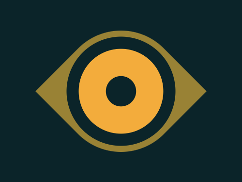
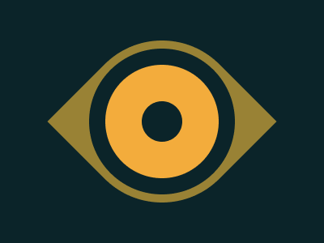

# #16. Eye of the Tiger

Challenge: <https://cssbattle.dev/play/16>

## Result

<table>
	<tr>
		<th width="50%">User Submission</th>
		<th width="50%">Target</th>
	</tr>
	<tr>
		<td width="50%" align="center">
			
		</td>
		<td width="50%" align="center">
			
		</td>
	</tr>
</table>

## Code

```html
<p a><p b><style>*{background:#0B2429}p{height:200;width:200;margin:42 92;position:fixed}[a]{rotate:45deg;border-radius:25vw 0;background:#998235}[b]{scale:0.25;border-radius:5in;border:45vw solid#F3AC3C;outline:20vw solid#0B2429;margin:-138-88
```
