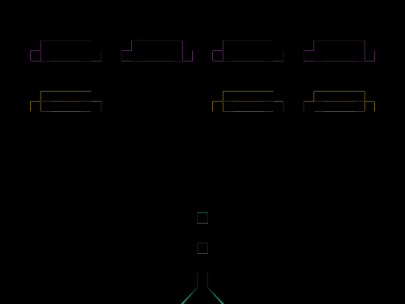
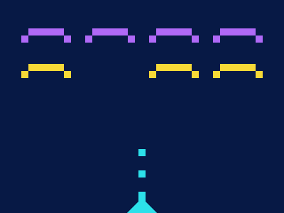

# #124. Space Invaders

Challenge: <https://cssbattle.dev/play/124>

## Result

<table>
	<tr>
		<th width="50%">User Submission</th>
		<th width="50%">Target</th>
	</tr>
	<tr>
		<td width="50%" align="center">
			
		</td>
		<td width="50%" align="center">
			
		</td>
	</tr>
</table>

## Code

```html
<p><p a><p b><p c><p d><p d e><p d f><p g><p h><style>&{background:#071945}p{width:50;height:10;color:#B069F7;margin:32 -18;box-shadow:50px 10px#071945,50px 0,40px 10px,60px 10px;position:fixed}[a]{left:98}[b]{left:188}[c]{left:278}[d]{color:#F8DA37;top:58}[e]{left:188}[f]{left:278}[g]{rotate:90deg;width:10;box-shadow:10px 0,40px 0,70px 0,80px 0;margin:192 187;color:#2CE1EA}[h]{width:0;border-style:solid;border-width:0px 20px 23px 20px;border-color:#2CE1EA#0000;box-shadow:0 0;margin:260 172}
```
