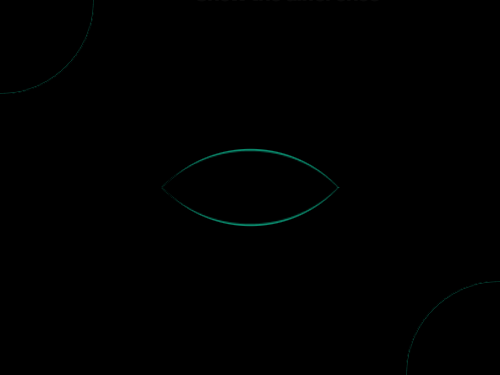
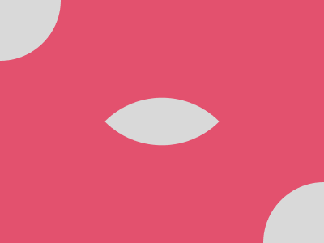

# #141. Third Eye

Challenge: <https://cssbattle.dev/play/141>

## Result

<table>
	<tr>
		<th width="50%">User Submission</th>
		<th width="50%">Target</th>
	</tr>
	<tr>
		<td width="50%" align="center">
			
		</td>
		<td width="50%" align="center">
			
		</td>
	</tr>
</table>

## Code

```html
<body bgcolor=E3516E><p><p a><style>p{position:fixed;height:150;width:150;background:#D9D9D9;border-radius:1in;margin:-83;box-shadow:25pc 75vw#D9D9D9}[a]{rotate:45deg;top:183;left:233;border-radius:1in 0;height:100;width:100
```
