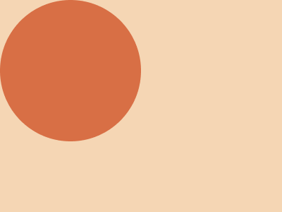

# #143. Simply Circle

Challenge: <https://cssbattle.dev/play/143>

## Result

<table>
	<tr>
		<th width="50%">User Submission</th>
		<th width="50%">Target</th>
	</tr>
	<tr>
		<td width="50%" align="center">
			
		</td>
		<td width="50%" align="center">
			
		</td>
	</tr>
</table>

## Code

```html
<body style="background:radial-gradient(circle at 25vw 25vw,#D86F45 25vw,#F5D6B4 0)"></body>
```
