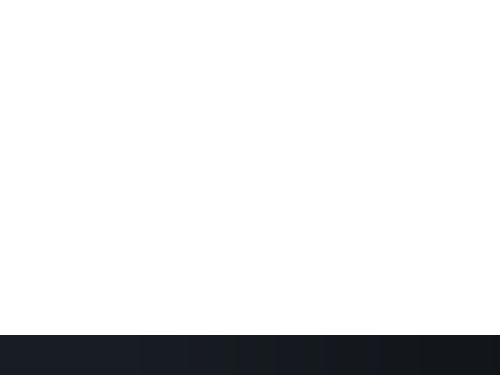

# #151. Pawn

Challenge: <https://cssbattle.dev/play/151>

## Result

<table>
	<tr>
		<th width="50%">User Submission</th>
		<th width="50%">Target</th>
	</tr>
	<tr>
		<td width="50%" align="center">
			
		</td>
		<td width="50%" align="center">
			
		</td>
	</tr>
</table>

## Code

```html
<p><p a><p a b><p c><p d><p e><style>*{background:#F5D6B4}p{background:#D86F45;position:fixed;height:65;width:140;margin:127 122}[a]{background:#F5D6B4;border-radius:3in;height:140;margin:69 32}[b]{left:188}[c]{top:78;height:40;border-radius:5vw 5vw 10px 10px}[d]{margin:102 152;height:20;width:80;border-radius:5px 5px 5vh 5vh}[e]{margin:47 167;height:50;width:50;border-radius:3in
```
