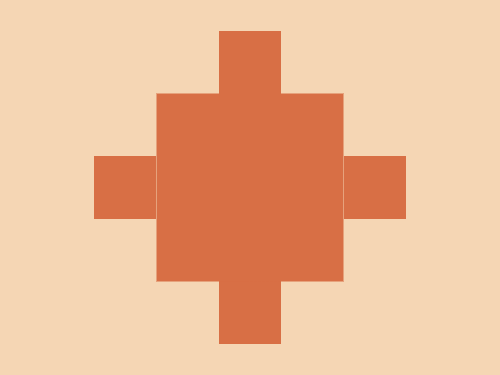

# #159. Portal

Challenge: <https://cssbattle.dev/play/159>

## Result

<table>
	<tr>
		<th width="50%">User Submission</th>
		<th width="50%">Target</th>
	</tr>
	<tr>
		<td width="50%" align="center">
			
		</td>
		<td width="50%" align="center">
			
		</td>
	</tr>
</table>

## Code

```html
<body bgcolor=F5D6B4><p><style>p{width:50;height:50;margin:25 167;background:#D86F45;box-shadow:0 25vw 0 50px#D86F45,25vw 25vw#D86F45,-25vw 25vw#D86F45,0 50vw#D86F45
```
