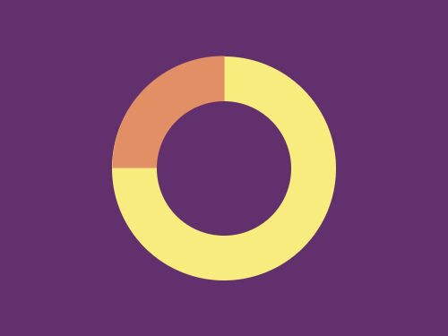
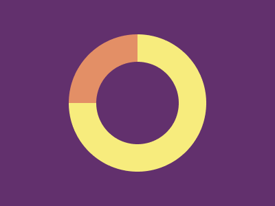

# #160. Donut

Challenge: <https://cssbattle.dev/play/160>

## Result

<table>
	<tr>
		<th width="50%">User Submission</th>
		<th width="50%">Target</th>
	</tr>
	<tr>
		<td width="50%" align="center">
			
		</td>
		<td width="50%" align="center">
			
		</td>
	</tr>
</table>

## Code

```html
<p z><p a><p b><style>*{background:#62306D}p{height:200;width:200;border-radius:3in;position:fixed;margin:42 92}[a]{background:#E38F66;scale:0.5;border-radius:4in 0 0;margin:-8 42}[b]{scale:0.6}[z]{background:#F7EC7D
```
