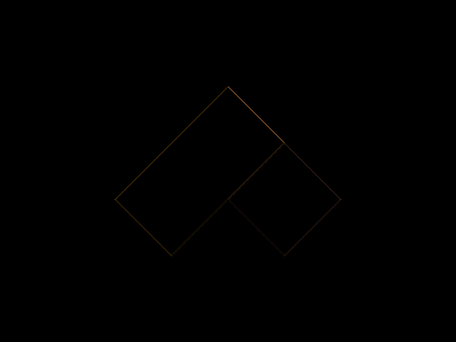

# #162. Upwards

Challenge: <https://cssbattle.dev/play/162>

## Result

<table>
	<tr>
		<th width="50%">User Submission</th>
		<th width="50%">Target</th>
	</tr>
	<tr>
		<td width="50%" align="center">
			
		</td>
		<td width="50%" align="center">
			
		</td>
	</tr>
</table>

## Code

```html
<p><p a><style>*{background:#998235}p{height:70;width:140;rotate:45deg;background:#FCBE5C;position:fixed;margin:107 147}[a]{background:#0B2429;rotate:-45deg;left:-42}
```
