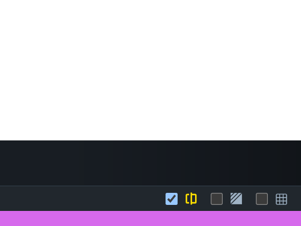

# #163. Missing Piece

Challenge: <https://cssbattle.dev/play/163>

## Result

<table>
	<tr>
		<th width="50%">User Submission</th>
		<th width="50%">Target</th>
	</tr>
	<tr>
		<td width="50%" align="center">
			
		</td>
		<td width="50%" align="center">
			
		</td>
	</tr>
</table>

## Code

```html
<p><p a><p b><style>*{background:#D669EC}p{background:#FDFBF8;position:fixed;clip-path:polygon(0 0,54%0,104%50%,100%100%,46%100%,0 53%);height:100;width:100;margin:32 82}[a]{scale:1-1;left:128}[b]{scale:1-1;top:128
```
