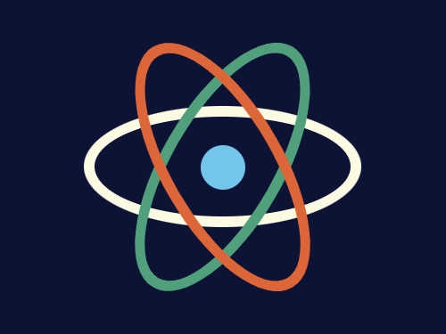
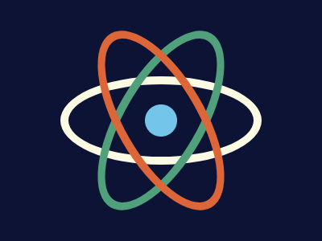

# #167. React India

Challenge: <https://cssbattle.dev/play/167>

## Result

<table>
	<tr>
		<th width="50%">User Submission</th>
		<th width="50%">Target</th>
	</tr>
	<tr>
		<td width="50%" align="center">
			
		</td>
		<td width="50%" align="center">
			
		</td>
	</tr>
</table>

## Code

```html
<p><p a><p a b><p a c><style>*{background:#0D1335}p{height:40;width:40;position:fixed;background:#73C6EA;margin:122 172;border-radius:50%}[a]{width:230;height:90;border:10px solid#FBFAE2;margin:87 67;background:#0000}[b]{rotate:120deg;border-color:#4FA07B}[c]{border-color:#DC6638;rotate:60deg
```
