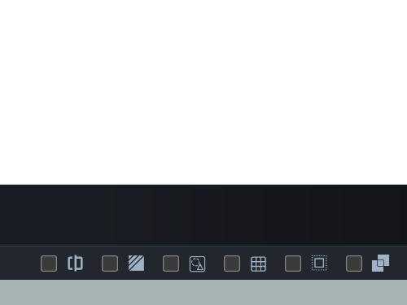
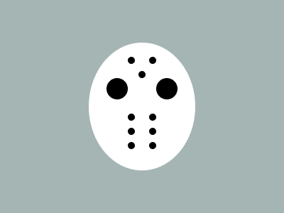

# #173. Hockey Mask

Challenge: <https://cssbattle.dev/play/173>

## Result

<table>
	<tr>
		<th width="50%">User Submission</th>
		<th width="50%">Target</th>
	</tr>
	<tr>
		<td width="50%" align="center">
			
		</td>
		<td width="50%" align="center">
			
		</td>
	</tr>
</table>

## Code

```html
<p><p a><style>*{background:#A5B5B4}p{background:#FFF;height:180;width:150;margin:60 117;border-radius:50%}[a]{height:10;width:10;background:#000;margin:-220 172;color:#000;box-shadow:30px 0,5vh 5vw,0 5pc,0 25vw,0 30vw,30px 5pc,30px 25vw,30px 30vw,-5vw 5ch 0 10px,50px 5ch 0 10px
```
