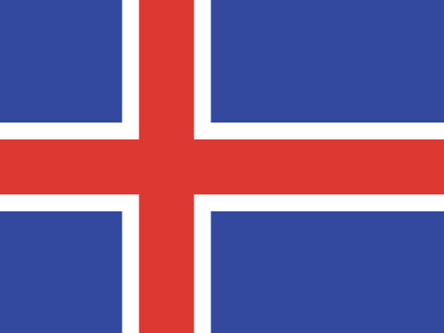
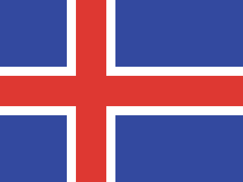

# #181. Iceland

Challenge: <https://cssbattle.dev/play/181>

## Result

<table>
	<tr>
		<th width="50%">User Submission</th>
		<th width="50%">Target</th>
	</tr>
	<tr>
		<td width="50%" align="center">
			
		</td>
		<td width="50%" align="center">
			
		</td>
	</tr>
</table>

## Code

```html
<p><p a><p b><p a b><style>&{background:#33499F}p{background:#FFF;height:80;position:fixed;width:900;margin:102-300}[b]{scale:0.62;background:#DE3832}[a]{rotate:90deg;left:0
```
