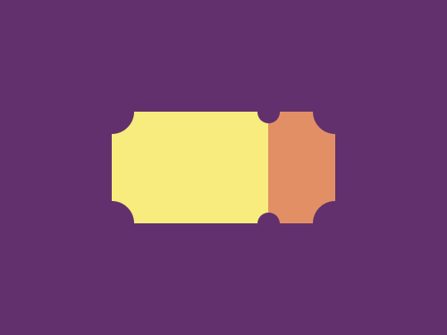

# #20. Ticket

Challenge: <https://cssbattle.dev/play/20>

## Result

<table>
	<tr>
		<th width="50%">User Submission</th>
		<th width="50%">Target</th>
	</tr>
	<tr>
		<td width="50%" align="center">
			
		</td>
		<td width="50%" align="center">
			
		</td>
	</tr>
</table>

## Code

```html
<body bgcolor=#62306D><p><style>p{background:#F7EC7D;height:100;width:140;margin:100 92;box-shadow:60px 0#E38F66}p:before{content:'';background:#62306D;height:40;width:40;border-radius:50%;position:fixed;top:80;left:80;box-shadow:50vw 0#62306D,0 25vw#62306D,50vw 25vw#62306D}p:after{content:'';background:#62306D;height:20;width:20;border-radius:50%;position:fixed;top:90;left:230;box-shadow:0 25vw#62306D
```
