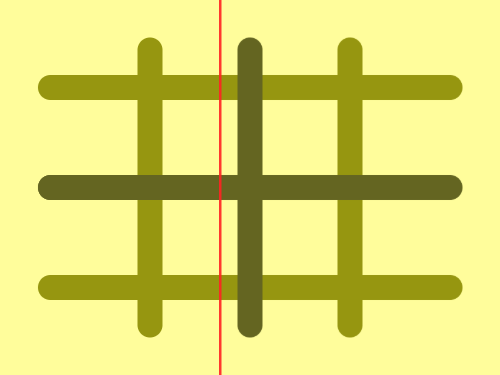
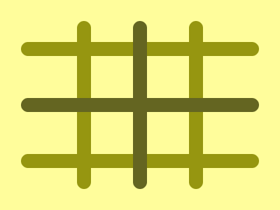

# #188. Icecream Sticks

Challenge: <https://cssbattle.dev/play/188>

## Result

<table>
	<tr>
		<th width="50%">User Submission</th>
		<th width="50%">Target</th>
	</tr>
	<tr>
		<td width="50%" align="center">
			
		</td>
		<td width="50%" align="center">
			
		</td>
	</tr>
</table>

## Code

```html
<p b><p a b><p c><style>*{background:#FFFD9B}p{background:#646521;color:#969610;height:20;position:fixed;width:340;margin:132 22;border-radius:1in}[a]{rotate:90deg;width:240;left:58}[b]{box-shadow:0 80px,0-80px
```
