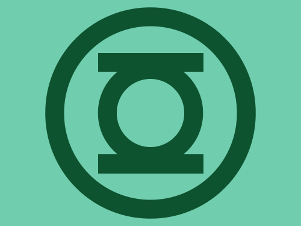
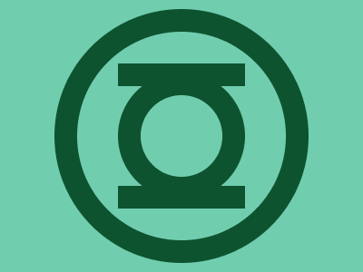

# #207. Green Lantern logo

Challenge: <https://cssbattle.dev/play/207>

## Result

<table>
	<tr>
		<th width="50%">User Submission</th>
		<th width="50%">Target</th>
	</tr>
	<tr>
		<td width="50%" align="center">
			
		</td>
		<td width="50%" align="center">
			
		</td>
	</tr>
</table>

## Code

```html
<p a><p b><p b c><style>*{background:#70CEAF}p{height:90;width:90;position:fixed}[a]{border-radius:3in;margin:97 147;color:#0E532F;box-shadow:0 0 0 25px,0 0 0 70px#70CEAF,0 0 0 95px}[b]{background:#0E532F;margin:62 122;height:25;width:140}[c]{top:143
```
