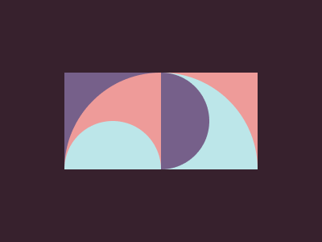

# #216. Pies

Challenge: <https://cssbattle.dev/play/216>

## Result

<table>
	<tr>
		<th width="50%">User Submission</th>
		<th width="50%">Target</th>
	</tr>
	<tr>
		<td width="50%" align="center">
			
		</td>
		<td width="50%" align="center">
			
		</td>
	</tr>
</table>

## Code

```html
<p><p b><p c><p d><p d b e ><p c e f><style>*{background:#37212D}z{background:#EE9B99}p{height:120;width:120;background:#76608A;position:fixed;margin:82 72}[b]{background:#EE9B99;border-radius:2in 0 0 0}[c]{height:60;border-radius:1in 1in 0 0;background:#BCE6E9;top:68}[d]{left:128;background:#EE9B99}[e]{background:#BCE6E9;rotate:90deg}[f]{background:#76608A;margin:52 162}
```
