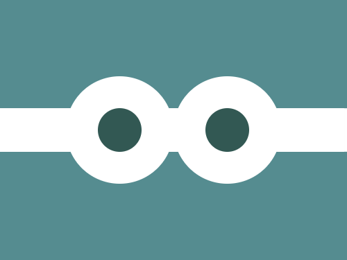
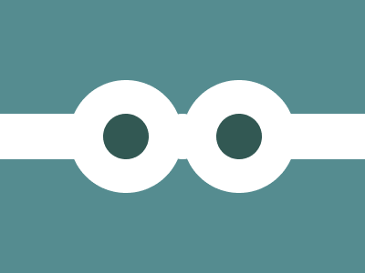

# #226. Bond

Challenge: <https://cssbattle.dev/play/226>

## Result

<table>
	<tr>
		<th width="50%">User Submission</th>
		<th width="50%">Target</th>
	</tr>
	<tr>
		<td width="50%" align="center">
			
		</td>
		<td width="50%" align="center">
			
		</td>
	</tr>
</table>

## Code

```html
<body bgcolor=558C90><p><p a><p b><style>p{position:fixed;height:50;width:400;background:#FFF;margin:117 -8}[a]{height:124;width:124;border-radius:1in;top:-29;left:84;box-shadow:31vw 0#FFF}[b]{background:#325853;width:50;border-radius:1in;left:121;box-shadow:31vw 0#325853
```
