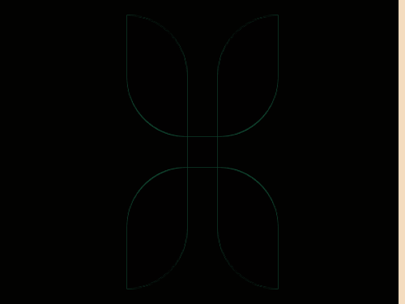
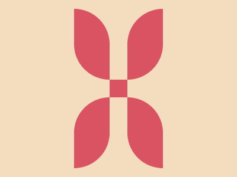

# #229. Flower

Challenge: <https://cssbattle.dev/play/229>

## Result

<table>
	<tr>
		<th width="50%">User Submission</th>
		<th width="50%">Target</th>
	</tr>
	<tr>
		<td width="50%" align="center">
			
		</td>
		<td width="50%" align="center">
			
		</td>
	</tr>
</table>

## Code

```html
<p><p a><p a b><p a c><p a b c d><style>*{background:#F4DCBF}p{background:#D95362;height:30;width:30;position:fixed;margin:127 177}[a]{height:120;width:60;margin:7 117;border-radius:0 1in}[b]{left:98;scale:1-1}[c]{top:158;scale:-1 1}[d]{scale:-1-1}
```
