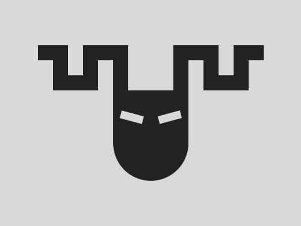
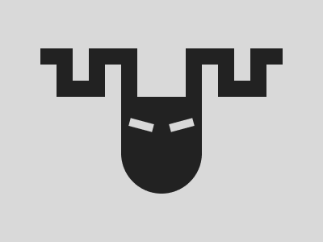

# #244. Medusa

Challenge: <https://cssbattle.dev/play/244>

## Result

<table>
	<tr>
		<th width="50%">User Submission</th>
		<th width="50%">Target</th>
	</tr>
	<tr>
		<td width="50%" align="center">
			
		</td>
		<td width="50%" align="center">
			
		</td>
	</tr>
</table>

## Code

```html
<body bgcolor=D9D9D9><p><p a><p b><p c><p c d><style>p{height:20;width:40;background:#222;position:fixed;margin:52 42;box-shadow:2cm 0#222,5cm 0#222,65vw 0#222,5vw 5ch#222,6cm 5ch#222}[a]{height:60;width:20;top:8;left:28;box-shadow:5ch 0#222,5pc 0#222,40vw 0#222,50vw 0#222,60vw 0#222}[b]{height:120;box-shadow:0 0;width:100;top:68;left:108;border-radius:0 0 53q 53q}[c]{height:10;width:30;background:#D9D9D9;box-shadow:0 0;transform:rotate(15deg);top:98;left:118}[d]{transform:rotate(-15deg);left:168
```
