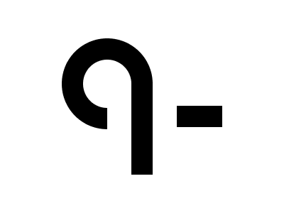

# #245. Knot

Challenge: <https://cssbattle.dev/play/245>

## Result

<table>
	<tr>
		<th width="50%">User Submission</th>
		<th width="50%">Target</th>
	</tr>
	<tr>
		<td width="50%" align="center">
			
		</td>
		<td width="50%" align="center">
			
		</td>
	</tr>
</table>

## Code

```html
<p c b><p a b><p a d><p e><style>p{background:#000;position:fixed}[c]{height:69;width:69;border-radius:1in;border:30px solid;margin:46 79}[b]{background:#FFF}[a]{height:136;width:34;margin:102 143}[d]{width:30;left:42}[e]{height:30;width:64;margin:141 241
```
