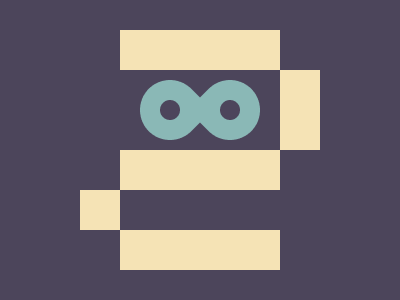

# #256. 256th

Challenge: <https://cssbattle.dev/play/256>

## Result

<table>
	<tr>
		<th width="50%">User Submission</th>
		<th width="50%">Target</th>
	</tr>
	<tr>
		<td width="50%" align="center">
			
		</td>
		<td width="50%" align="center">
			
		</td>
	</tr>
</table>

## Code

```html
<p><p a><p b><p c><p c d><p c e><p c e f><p c e g><p c e g h><style>*{background:#4C455B}p{background:#F5E3B5;height:40;width:160;position:fixed;margin:22 112}[a]{top:128}[b]{top:208}[c]{margin:182 72;width:40}[d]{margin:62 272;height:80}[e]{scale:1.5;background:#8AB8B6;margin:82 142;border-radius:1in 0 1in 1in;rotate:45deg}[f]{rotate:-135deg;left:68}[g]{background:#4C455B;border-radius:1in;scale:0.5}[h]{left:68
```
