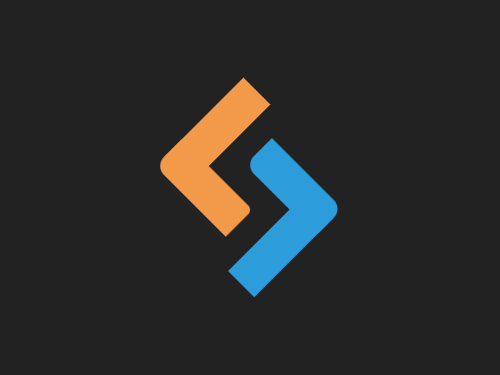

# #21. SitePoint Logo

Challenge: <https://cssbattle.dev/play/21>

## Result

<table>
	<tr>
		<th width="50%">User Submission</th>
		<th width="50%">Target</th>
	</tr>
	<tr>
		<td width="50%" align="center">
			
		</td>
		<td width="50%" align="center">
			
		</td>
	</tr>
</table>

## Code

```html
<div id="orange"></div><div id="blue"><style>body{background:#222;display:grid;place-content:center;grid-auto-flow:column}div{width:80;height:30;rotate:45deg;position:relative}#orange{background:#F2994A;left:3;border-radius:0 5px 0 10px}#blue{background:#2D9CDB;right:5;bottom:1;border-radius:0 10px 5px}div:before{content:"";display:block;width:30;height:90;position:relative}#orange:before{background:#F2994A;bottom:70}#blue:before{background:#2D9CDB;left:50;top:10
```
