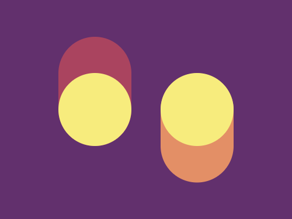
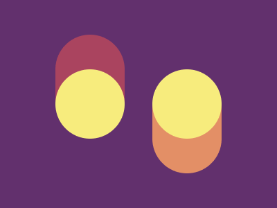

# #24. Switches

Challenge: <https://cssbattle.dev/play/24>

## Result

<table>
	<tr>
		<th width="50%">User Submission</th>
		<th width="50%">Target</th>
	</tr>
	<tr>
		<td width="50%" align="center">
			
		</td>
		<td width="50%" align="center">
			
		</td>
	</tr>
</table>

## Code

```html
<body bgcolor=62306D><p><p a><style>p{height:150;width:100;background:#AA445F;margin:42 72;border-radius:1in;box-shadow:140px 50px#E38F66;position:fixed}[a]{height:100;background:#F7EC7D;box-shadow:140px 0#F7EC7D;top:58
```
