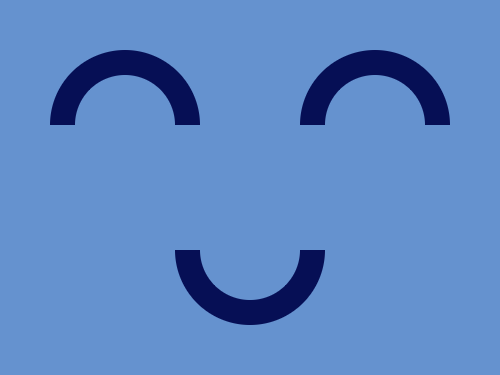

# #26. Smiley

Challenge: <https://cssbattle.dev/play/26>

## Result

<table>
	<tr>
		<th width="50%">User Submission</th>
		<th width="50%">Target</th>
	</tr>
	<tr>
		<td width="50%" align="center">
			
		</td>
		<td width="50%" align="center">
			
		</td>
	</tr>
</table>

## Code

```html
<body bgcolor=#6592CF><p><p a><p b><style> p{height:40;width:80;position:fixed;border-radius:99px 99px 0 0;top:24;left:40;border:20px solid#060F55;border-bottom:0}[a]{left:240}[b]{transform:rotate(180deg);top:184;left:140
```
