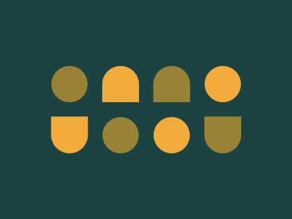
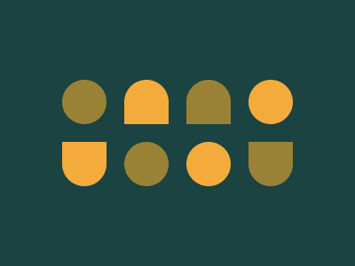

# #28. Cups & Balls

Challenge: <https://cssbattle.dev/play/28>

## Result

<table>
	<tr>
		<th width="50%">User Submission</th>
		<th width="50%">Target</th>
	</tr>
	<tr>
		<td width="50%" align="center">
			
		</td>
		<td width="50%" align="center">
			
		</td>
	</tr>
</table>

## Code

```html
<body bgcolor=#1A4341><p><style>p{height:50;width:50;background:#998235;margin:90 62;border-radius:50px;box-shadow:210px 0#F3AC3C,140px 70px#F3AC3C,70px 70px#998235}p:before,p:after{content:'';display:block;position:fixed;background:#F3AC3C;height:50;width:50;border-radius:50px 50px 0 0;top:90; left:140;box-shadow:70px 0#998235;}p:after{transform:rotate(180deg);top:160; left:70;box-shadow:-210px 0#998235
```
