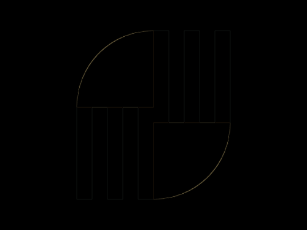

# #262. Pinwheel

Challenge: <https://cssbattle.dev/play/262>

## Result

<table>
	<tr>
		<th width="50%">User Submission</th>
		<th width="50%">Target</th>
	</tr>
	<tr>
		<td width="50%" align="center">
			
		</td>
		<td width="50%" align="center">
			
		</td>
	</tr>
</table>

## Code

```html
<p a><p a b><p c><p c d><style>&{background:#243D83}p{height:100;width:100;margin:132 92;position:fixed}[a]{height:120;background:repeating-linear-gradient(90deg,#6592CF,#6592CF 20px,#243D83 20px,#243D83 40px)}[b]{margin:32 192}[c]{background:#FFF;border-radius:9in 0 0;margin:32 92}[d]{rotate:180deg;margin:152 192
```
