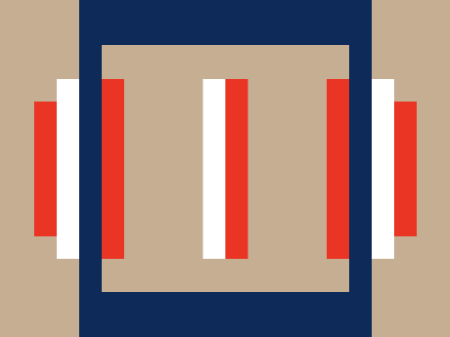
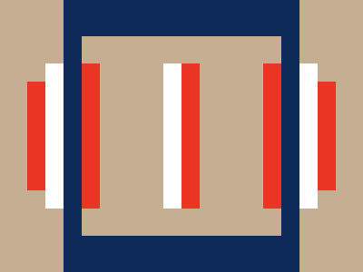

# #265. Barcode

Challenge: <https://cssbattle.dev/play/265>

## Result

<table>
	<tr>
		<th width="50%">User Submission</th>
		<th width="50%">Target</th>
	</tr>
	<tr>
		<td width="50%" align="center">
			
		</td>
		<td width="50%" align="center">
			
		</td>
	</tr>
</table>

## Code

```html
<p b><p a><p c><style>*{background:#C5AE92}p{height:160;width:20;background:#FFF;color:#EA3424;position:fixed;margin:62 42}[a]{height:120;margin:82 22;background:#EA3424;box-shadow:320px 0}[b]{box-shadow:40px 0, 150px 0,130px 0#FFF,240px 0,280px 0#FFF}[c]{width:220;;height:220;border:solid #0D2A58;border-width:40px 20px;background:#0000;margin:-8 62
```
